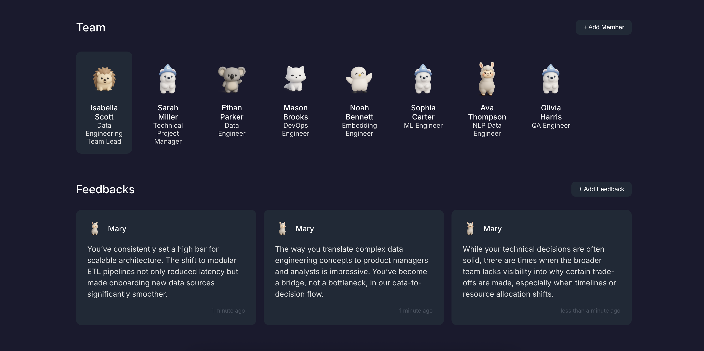

# AI Team Feedback Platform - Multi-Agent Framework Experiment

---

## Overview

This project is a **multi-agent framework experiment** designed to facilitate collaborative team feedback and management. It demonstrates a modular, React-based application with a dark theme, supporting team member management and feedback collection. The project is structured for extensibility and experimentation with agent-based workflows.

   

## Features

- **Team Management:** Add, view, and remove team members with unique avatars.
- **Feedback System:** Submit, view, and delete feedback for each team member.
- **Persistent Storage:** Data is saved in the browser's local storage for persistence across sessions.
- **Dark Theme:** Modern, accessible dark UI using styled-components.
- **Mock Data:** Preloaded team members and feedback for demonstration.
- **Modular Components:** Clean separation of UI and logic for easy extension.
- **Multi-Agent Experimentation:** Foundation for agent-based or multi-user collaborative features.

## Project Structure

```
metagpt/
├── src/
│   ├── components/         # React components (Team, Feedback, Modals, etc.)
│   ├── utils/              # Utility functions (mock data, localStorage helpers)
│   ├── styles/             # Global and theme styles (dark mode)
│   ├── App.jsx             # Main application logic
│   └── index.jsx           # Entry point
├── public/avatars/         # Avatar images for team members
├── metagpt/tools/schemas/  # YAML schemas for agent/data tools
├── docs/                   # Documentation (PRD, system design, tasks)
├── resources/              # Additional resources (PRD, system design, analysis)
├── package.json            # Project metadata and dependencies
├── requirements.txt        # (For Python-based tools, if any)
├── vite.config.js          # Vite configuration
└── README.md               # This file
```

## Setup & Installation

1. **Clone the repository:**
   ```bash
   git clone <repo-url>
   cd metagpt
   ```
2. **Install dependencies:**
   ```bash
   npm install
   ```
3. **Run the development server:**
   ```bash
   npm run dev
   ```
4. **Open in your browser:**
   Visit [http://localhost:5173](http://localhost:5173) (or as indicated in the terminal)

## Usage

- **Add Team Member:** Click the add button, fill in details, and submit.
- **Select Team Member:** Click a member to view or add feedback.
- **Add Feedback:** Select a member, then add feedback via the modal.
- **Delete:** Remove team members or feedback as needed.

## Assets

- Avatars are located in `public/avatars/` and `avatars/`.
- Main project image: `/Users/das/Documents/metagpt/readme.png`

## Documentation

- Product Requirements: `resources/prd/20250605190449.md`
- System Design: `resources/system_design/20250605190449.md`
- Additional docs in `docs/` and `resources/`

## Tech Stack

- **Frontend:** React 19, styled-components, Vite
- **State & Storage:** React state, browser localStorage
- **Other:** Modular YAML schemas for agent/data tools (see `metagpt/tools/schemas/`)

## License

This project is licensed under the ISC License.

---

> _This is an experimental project for multi-agent frameworks and collaborative team feedback. For more details, see the documentation folders._ 